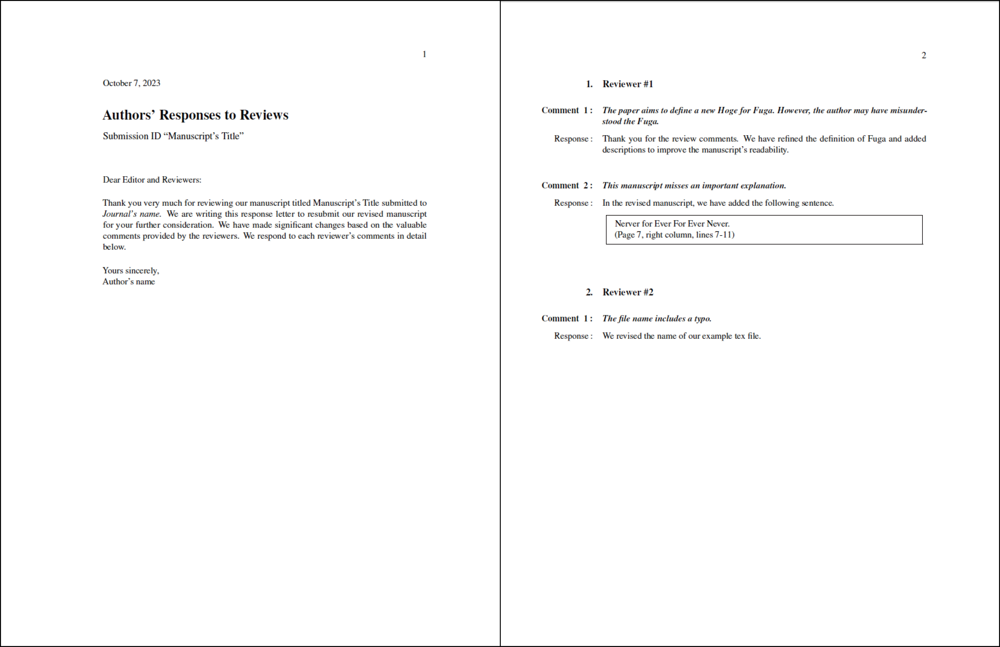

# Author Response Letters
Latex template to write author response letters to review comments. Based on @mschroen's [review_response_letter](https://github.com/mschroen/review_response_letter) and @zhangks98's [author-response-letter](https://github.com/zhangks98/author-response-letter). 


## Example
See the example `ReponseLetter.tex`. Please ensure the class file `ar2rc.cls` is in the same directory.




### LaTeX commands
```  
\section{Reviewer 1}
\subsection{} 
\RC Reviwer comment.
\AR Author response.

\begin{quote} \end{quote}
\DIFdelbegin \DIFdel{Deleted phrase}\DIFdelend
\DIFaddbegin \DIFadd{Added phrase}\DIFaddend
```

Then run `pdflatex ReponseLetter.tex` to make `ReponseLetter.pdf`, or typeset with any TeX front-end program.


## Change log

- 2022 10/7
    - Replaced abbreviations of RC and AR with Comment and Response, respectively
    - Added automatical index insert to `\RC`
    - Changed the margins
    - Changed the title's size
- 2023 10/7
    - Changed the margin after \section.
    - Updated an example

